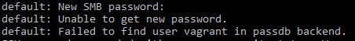
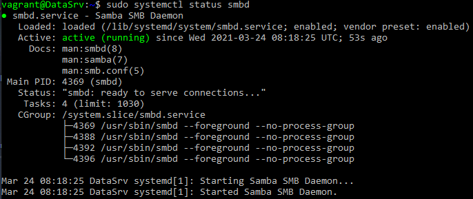

# 📑 LB2 Dokumentation - SMB Shares mit Portfreigabe 📑
<p align="left">
  
  
</p>

_Erstellt von [Raphael Frisano](https://github.com/RaphaelFrisano) am 12.03.2021_

---
<br>

# 🖼️ Grafische Übersicht der Umgebung 🖼️
```
+----------------------------------+
! PC - Privatnetz (192.168.1.25)   !
! HyperVisor - HyperV              !                 
! Port: 42000                      !	
!                                  !	
!      +--------------------+      !
!      ! SMB Server         !      !       
!      ! Host: DataSrv      !      !
!      ! IP: localhost      !      !
!      ! Port: 445          !      !
!      ! Nat: 42000         !      !
!      +--------------------+      !
!                                  !	
+----------------------------------+
```
<h2>🗂️ Ordnerstruktur 🗂️</h2>

- \\\DataSrv
  - \Data
    - \TestFolder

# 📜 Projektbeschreibung 📜
> Auf einer ["generic ubuntu box 1804"](https://app.vagrantup.com/generic/boxes/ubuntu1804) box als erstes ein SMB Server installiert sowie konfiguriert. Es wird eine kleine Ordnerstruktur erstellt welche von der Gruppe "Informaticians" gelesern und verändert werden kann. Zu dieser Gruppe wird am start der default vagrant user hinzugefügt.<br>
> Um die Shares übersichtlicher für die Endbenutzer aufzubereiten wird der Server zu DataSrv umbenannt so das einfach über "\\\DataSrv\Data" auf alle Shares zugegriffen werden kann.

# ❔ Wie es funktioniert ❔
Der grösste und vorallem wichtigste Teil des Projekts wird über den inline shell provisioner von Vagrant ausgeführt. Jede Zeile im Provisioner wird als zeile gesehen die an die CMD der VM weitergegeben wird. Dies ermöglicht uns alles mögliche zu konfigurieren und zu installieren indem wir einfach schon vorgeben was an die Konsole weitergegeben werden soll.
```
config.vm.provision "shell", inline: <<-SHELL
  # Kommandos zur cmd #
SHELL
```

Es ist eigentlich so gut wie alles im Code Dokumentiert, jedoch erläuter ich hier etwas genauer was genau gemacht wird:

<h2>🖥️ Server Konfigurationen 🖥️</h2>
Hier wird als erster mit dem Kommando hostnamectl den Hostname des Servers von Ubuntu1804 auf DataSrv geändert. Dies soll dann sp$ter den Usern zu nutzen zu kommen indem die SMB Shares einfacher anzusprechen sind da der Servername ersichtlicher ist.<br>
Danach wird Samba selbst auf den Server installiert. <br>
Mit dem Kommando `sed -i -e` wird das config file `/etc/samba/smb.conf` nach `workgroup=` durchsucht, und anschliessend mit `workgroup=WORKGROUP` ersetzt. So konnte ich das File editieren ohne wissen zu müssen, wo im File diese Config ist.

```sh
config.vm.provision "shell", inline: <<-SHELL
  hostnamectl set-hostname DataSrv

  sudo apt-get install samba -y
  sed -i -e 's/workgroup=/workgroup=WORKGROUP/g' /etc/samba/smb.conf
SHELL
```

<h2>📁 Ordner & Berechtigungen 📁</h2>
In diesem Abteil werden unsere beiden Ordner /data und /data/Testfolder erstellt. Danach erstellen wir eine neue Gruppe namens "informaticians" welche darauf Schreib- sowie Leseberechtigungen bekommt.<br>
Der User vagrant wird dazwischen zur gruppe "informaticians" hinzugefügt.

```sh
config.vm.provision "shell", inline: <<-SHELL
  sudo mkdir /data
  sudo mkdir /data/Testfolder
  sudo groupadd informaticians
  sudo usermod -aG informaticians vagrant 
  sudo chown -R :informaticians /data
  sudo chmod -R g+rw /data
SHELL
```

<h2>🗃️ SMB Konfigurationen 🗃️</h2>
Mit den >> Zeichen addieren wir den vorher geschriebenen Text zum SMB config file. Das wir hinzufügen ist unser DATA folder so dass er von SMB geshared wird und nur die Gruppe "informaticians" auch wirklich darauf zugreifen kann.<br>
Wir haben zwar vorher den User vagrant zur gruppe informaticians hinzugefügt, jedoch muss jeder User noch dazu zum SMB selbst hinzugefügt werden. mit der Pipe "|" können wir dem command `sudo smbpasswd -a vagrant` automatisch das passwort 2 mal hinzufügen. *(/n ist ein Enter da wir 2 mal das passwort eingeben müssen.)*<br>
Zum schluss wird dann der User vagrant auf smb aktiviert.

```sh
config.vm.provision "shell", inline: <<-SHELL
  echo "[DATA]" >> /etc/smb.conf
  echo "path = /data" >> /etc/smb.conf
  echo "valid users = @informaticians" >> /etc/smb.conf
  echo "browsable = yes" >> /etc/smb.conf
  echo "writable = yes" >> /etc/smb.conf
  echo "read only = no" >> /etc/smb.conf

  echo -e vagrant\nvagrant | sudo smbpasswd -a vagrant
  sudo smbpasswd -e vagrant
SHELL
```

# 🔧 Probleme beim Testing 🔧
<h3>❗ Passwort für den vagrant User auf SMB konfigurieren ❗</h3>
<p align="left">
  
</p>

> Als das Passwort das erste mal nicht funktionierte konnte ich eine schnelle Lösung finden. Mein problem war das ich das echo PASWORT nicht gepiped habe, dadurch wurde bei dem commando kein Passwort angegeben und es war schnell ersichtlich da das Passwort einfach nachtröglich ausgegeben war.

> Beim zweiten versuch wurde zwar das passwort mitgegeben, jedoch muss man das Passwort 2 mal angeben. Ich habe nach Möglichkeiten gesucht und diese gewählt welche sonst eigentlich überall funktioniert, nämlich mit einem \n (einem ENTER) einfach das passwort 2 mal zu senden. Leider musste ich schmerhaft herausfinden dass dies bei SMB nicht funktionierte.<br>
Dies ist leider ein Problem das ich bis zum Ende des Projektes nicht abschliessen konnte.

<br>
<h3>❓ SMB Share im Netzwerk sichtbar machen ❓</h3>
<p align="left">
  
</p>

> Nachdem alle config Files richtig configuriert wurden und der SMB Daemon ohne probleme lief (oben ersichtlich) war es mitr nur möglich den Server selbst zu sehen *\\\DataSrv* aber nicht die Unterordner. Jedes mal wo ich versuchte mich zu verbinden gab es einen Error / der ordner konnte nicht gefunden werden. Ich habe mich erkundigt an was dies liegen könnte, habe sogar die Portweiterlietung etc verändert doch nichts beseitigte das Problem.<br>
Deshalb ist dies leider auch ein Problem das ich bis zum Ende des Projektes nicht abschliessen konnte.

# 📚 Quellen 📚
<h3>Für Projekt benötigte Daten</h3>

[Genutze Box als Basis](https://app.vagrantup.com/generic/boxes/ubuntu1804)

<h3>Tutorials / Informationen</h3>

[Synced Folder](https://www.vagrantup.com/docs/synced-folders/smb)<br>
[SMB Shares](https://wirywolf.com/2014/03/vagrant-mount-guest-samba-shares.html)<br>
[Provisioning](https://www.vagrantup.com/docs/provisioning/basic_usage)