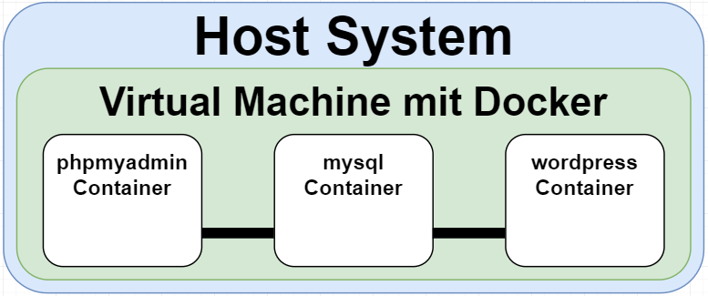

# 📑 LB3 Dokumentation - Automatisches Wordpress mit Datenbank 📑
<p align="left">
  
  
</p>

_Erstellt von [Raphael Frisano](https://github.com/RaphaelFrisano) am 20.04.2021_

---
<br>

# 🖼️ Grafische Übersicht der Umgebung 🖼️



<h2>☄️ Ports & verbindungen ☄️</h2>
<p>
phpmyadmin ➡️ Port 8000 ➡️ mysql
</p>
<p>
mysql ➡️ Port 8000 ➡️ wordpress
</p>
<p>
wordpress ➡️ Port 8000 ➡️ Virtual Machine
</p>
<p>
Virtual Machine ➡️ Port 8000 ➡️ Host System
</p>


# 📜 Projektbeschreibung 📜
> Mit Docker compose werden automatisch 3 Container gestartet;<br>
> Als erstes wird der Container erstellt, auf dem die mysql Datenbank läuft.<br>
> Danach wird der zweite Container mit PHPmyadmin gestartet um die Datenbank über einen Browser managen zu können.<br>
> Zu gute letzt wird dann als drittes der Container mit Wordpress erstellt, welcher die mysql Datenbank im hintergrund verwendet.

# ❔ Wie es funktioniert ❔
Am start des Files wird ein Volume für die Datenbank / Website erstellt, sowieein Netzwerk so dass alle Container miteinander kommunizieren können.
```yml
volumes:
  db_data:
networks:
  wpsite:
```

Der rest des ganzen Files ist in 3 Teile aufgeteilt:

<h2>🐬 mysql Konfiguration 🐬</h2>
Hier wird als erstes der Container "db" erstellt, mit Passwort, User, etc. für die Datenbank.

Es wird auch angegeben das der Container nach einem Docker Neustart wieder aufgestartet werden soll und das er im Netzwerk wpsite ist.

```yml
db:
  image: mysql:latest
  volumes:
    - db_data:/var/lib/mysql
  restart: always
  environment:
    MYSQL_ROOT_PASSWORD: password
    MYSQL_DATABASE: mybase
    MYSQL_USER: raphael
    MYSQL_PASSWORD: password
  networks:
    - wpsite
```

<h2>⛵ phpmyadmin Konfiguration ⛵</h2>
Danach wird hier der Container phpmyadmin erstellt. Dies jedoch nur imfall das der Container "db" schon läuft. Es werden alle Daten angegeben sodass sich phpmyadmin auf die DB einloggen kann und die Ports zur Weboberfläche werden weitergeleitet.

Es wird auch angegeben das der Container nach einem Docker Neustart wieder aufgestartet werden soll und das er im Netzwerk wpsite ist.

```yml
phpmyadmin:
  depends_on:
    - db
  image: phpmyadmin:latest
  restart: always
  ports:
    - '8080:80'
  environment:
    PMA_HOST: db
    MYSQL_ROOT_PASSWORD: password
  networks:
    - wpsite
```

<h2>📰 Wordpress Konfiguration 📰</h2>
Zu guter letzt wird dann der Wordpress Container aufgesetzt. Dies jedoch nur imfall das der Container "db" schon läuft. Es werden alle Daten angegeben sodass sich Wordpress auf die DB einloggen kann und die Ports zur Website werden weitergeleitet.
Das Volumen für die Website wird auch schon erstellt.

Es wird auch angegeben das der Container nach einem Docker Neustart wieder aufgestartet werden soll und das er im Netzwerk wpsite ist.

```yml
wordpress:
  depends_on:
    - db
  image: wordpress:latest
  ports:
    - '8000:80'
  restart: always
  volumes: ['./:/var/www/html']
  environment:
    WORDPRESS_DB_HOST: db:3306
    WORDPRESS_DB_USER: raphael
    WORDPRESS_DB_PASSWORD: password
  networks:
    - wpsite
```


# 🔧 Testing 🔧
<h3>❗ Passwort für den vagrant User auf SMB konfigurieren ❗</h3>

<h3>❓ SMB Share im Netzwerk sichtbar machen ❓</h3>


# 📚 Quellen 📚
<h3>Für Projekt benötigte Container</h3>

[mysql](https://hub.docker.com/_/mysql)<br>
[phpmyadmin](https://hub.docker.com/_/phpmyadmin)<br>
[wordpress](https://hub.docker.com/_/wordpress)<br>

<h3>Tutorials / Informationen</h3>

[Screencasts](https://www.nanoo.tv/link/v/DDKjuKJG)<br>
[Docker cheatsheet](https://tbzedu.sharepoint.com/sites/M300_Documents/Freigegebene%20Dokumente/Forms/AllItems.aspx?id=%2Fsites%2FM300%5FDocuments%2FFreigegebene%20Dokumente%2Fcheat%2Dsheet%2Dv2%2Epdf&parent=%2Fsites%2FM300%5FDocuments%2FFreigegebene%20Dokumente&p=true&originalPath=aHR0cHM6Ly90YnplZHUuc2hhcmVwb2ludC5jb20vOmI6L3MvTTMwMF9Eb2N1bWVudHMvRVJZLUdwRjR3V2hKdEJJSV8tV0htSmtCNURPRWVZTkNfNExxa0tVSlRGSnlCdz9ydGltZT1jU3RweGNBRDJVZw)<br>
[Dockerhub (Einzelne Container)](https://hub.docker.com/)